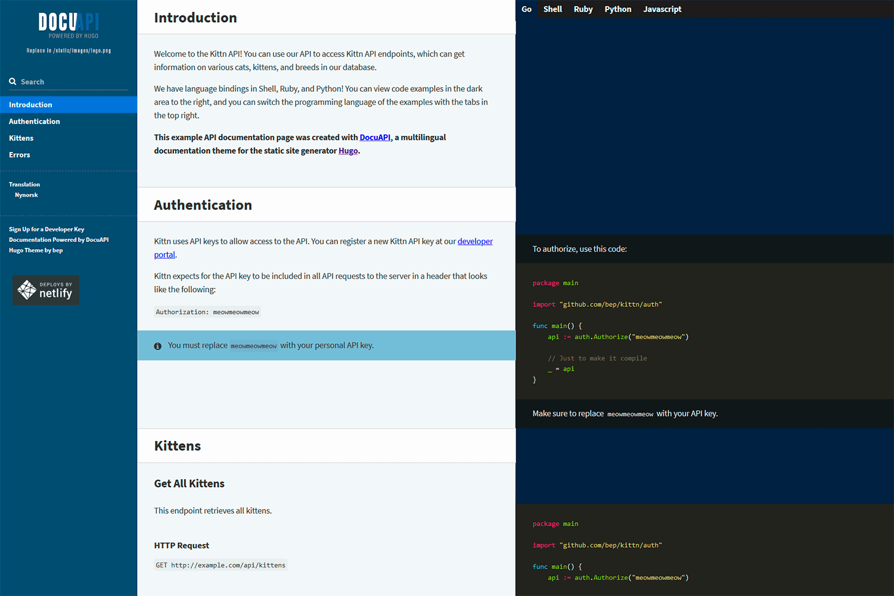

### hugo的介绍
hugo是一个 **不一般的** 静态网站生成器

[官方文档](https://gohugo.io/getting-started/)

[中文文档](https://www.gohugo.org/)


- 安全性:
	- 基于go module文件,保证第三方插件的安全(checksum)
	- 文件保护(跨项目目录文件,项目内软链接-只可读)
	- GDPR 数据隐私保护(欧盟隐私条例),大厂埋点配置化,可以启用保护规则 （国内好像也有这种趋势）
- 特性:
	- 静态页面; 安全迅速
	- 构建时间短- 相比 hexo实在是太快了
	- 分类,pretty url
	- 开发模式热加载; 
	- 随时随地发布,无依赖(go特性)
	- Toml Yaml Json配置文件支持

### hugo安装

> hugo的安装，下载源码 执行 **go install --tags extended**  

[源码地址](https://github.com/gohugoio/hugo) 

### 基础支持:
- [x] 支持mermaid
- [x] 支持mathjax
- [x] 评论
- [x] 本地图片支持


#### mermaid支持
```html
<script src="https://cdn.jsdelivr.net/npm/mermaid/dist/mermaid.min.js"></script>
<script>mermaid.initialize({ startOnLoad: true });</script>
<script>
  Array.from(document.getElementsByClassName('language-mermaid')).forEach(el => {
    el.parentElement.outerHTML = `<div class="mermaid">${el.innerText}</div>`
  })
</script>
```

#### 评论支持
[文档](https://github.com/apps/utterances)

#### 本地资源
``


### hugo help


### 推荐主题

docuapi: `https://hub.fastgit.org/bep/docuapi`
为document编写而生



LoveIt `github.com/dillonzq/LoveIt`
https://hugoloveit.com/categories/documentation/

比较养眼的主题了