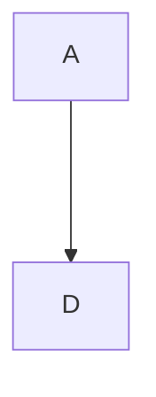

### hugo安装

hugo的安装，下载源码，**go install --tags extended**  即可 [源码地址](https://github.com/gohugoio/hugo) [中文文档](https://www.gohugo.org/)

### 关于mermaid支持
```html
<script src="https://cdn.jsdelivr.net/npm/mermaid/dist/mermaid.min.js"></script>
<script>mermaid.initialize({ startOnLoad: true });</script>
<script>
  Array.from(document.getElementsByClassName('language-mermaid')).forEach(el => {
    el.parentElement.outerHTML = `<div class="mermaid">${el.innerText}</div>`
  })
</script>
```



$$
a^2
$$