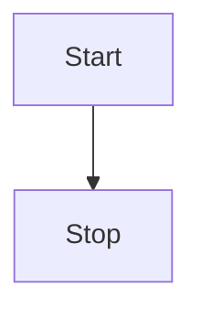

### 前言

为了规范博客的内容，具有更好的可读性。 -----格式要求
提供Markdown基本语法查询  ----  MarkDown基本语义。

### 格式要求

1. 基本的博客文章要满足总分总的布局格式（软八股） 前言---- 内容 --- 总结 。
2. 文章不许留空,文章没准备好，可以正文填充"待完善"。
3. ">" 层次不清楚的可以用这个符号来提示缩进

### MarkDown基本语义

#### 视频

>> 视频直观。但是不建议滥用。blog的空间就500M,能用图片就用图片代替。

*直观效果:*  

<video id="video" controls="" preload="none">
      <source id="mp4" src="" type="video/mp4"/>
      <p>Your user agent does not support the HTML5 Video element.</p>
</video>

*演示代码:*

```html
<video id="video" controls="" preload="none">
      <source id="mp4" src="" type="video/mp4"/>
      <p>Your user agent does not support the HTML5 Video element.</p>
</video>
```

#### 图片,链接

*直观效果:*
这是一个图片
这是一个图片的行内链接[![hexo-image]](http://www.baidu.com)
这是一个引用的图片链接[![hexo-image]][hexo-url]
这是一个文字的行内链接[百度](http://www.baidu.com)  
这是一个文字的引用链接[百度][baidu]

*演示代码:*

```text
这是一个图片
这是一个图片的行内链接[![hexo-image]](http://www.baidu.com)
这是一个引用的图片链接[![hexo-image]][hexo-url]
这是一个文字的行内链接[百度](http://www.baidu.com)  
这是一个文字的引用链接[百度][baidu]
```

#### 本地图片链接

修改配置文件_config.yml

```yml
post_asset_folder: true 
```

建立同名博客文件夹,存储图片 \hexo\swig.PNG
> 发布后会创建： 2016/10/10/hexo/swig.PNG

引用方式
```swig





```

示例：
  


#### 表格

*直观效果:*

| Tables        |      Are      |  Cool |
| ------------- | :-----------: | ----: |
| col 3 is      | right-aligned | $1600 |
| col 2 is      |   centered    |   $12 |
| zebra stripes |   are neat    |    $1 |

*演示代码:*

```markdown
| Tables        |      Are      |  Cool |
| ------------- | :-----------: | ----: |
| col 3 is      | right-aligned | $1600 |
| col 2 is      |   centered    |   $12 |
| zebra stripes |   are neat    |    $1 |

```

#### 粗体和斜体,强调

*直观效果:*
这是**粗体**  
这是*斜体*  
这是`强调`  
*演示代码:*

```markdown
这是**粗体**  
这是*斜体*  
这是`强调`  
```

#### 标注

#### 列表

##### 无序列表

*直观效果:*
- 列表1
- 列表2

```markdown
- 列表1
- 列表2
```

##### 有序列表

*直观效果:*
1. 列表1
>dfasdfasdff[url](www.baidu.com)
1. 列表2
*演示代码:*
```
- 列表1
- 列表2

```

#### 转义字符

| 显示结果 | 实体名称             |
| :------- | :------------------- |
| &nbsp;   | &amp;nbsp;           |
| &lt;     | &amp;lt;             |
| &gt;     | &amp;gt;             |
| &amp;    | &amp;amp;            |
| &quot;   | &amp;quot;           |
| &#39;    | &amp;apos;(IE不支持) |

[hexo-image]: http://img.shields.io/badge/Hexo-2.4+-2BAF2B.svg?style=flat-square
[hexo-url]: http://hexo.io  
[baidu]: http://www.baidu.com

#### TODO

- [ ] 支持以 PDF 格式导出文稿
- [ ] 改进 Cmd 渲染算法，使用局部渲染技术提高渲染效率
- [x] 新增 Todo 列表功能
- [x] 修复 LaTex 公式渲染问题
- [x] 新增 LaTex 公式编号功能

#### 画图

已经支持mermaid



### 总结

工欲善其事必先利其器